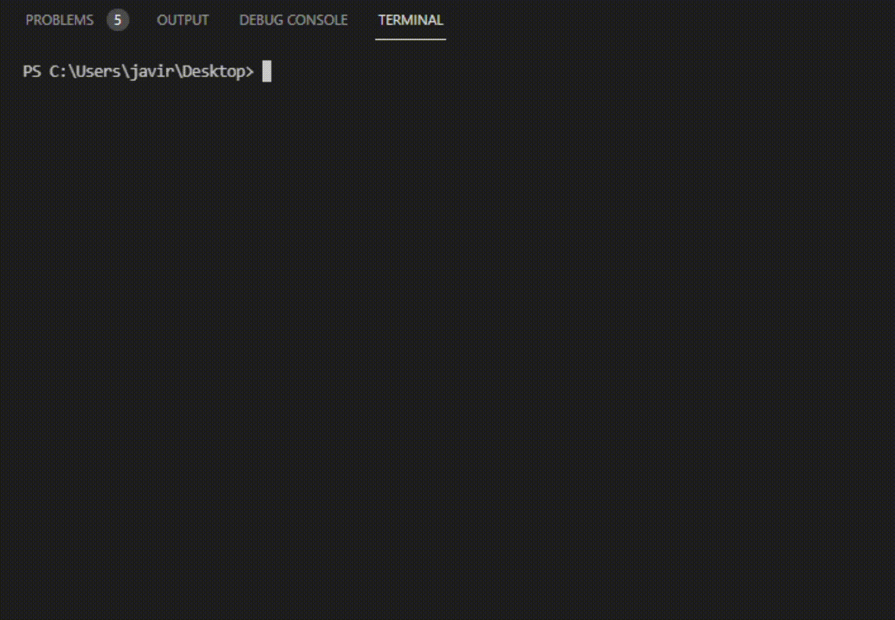

# Jewels_Legend_Hero

`Jewels_Legend_Hero` es un juego similar al Candy Crush que se ejecuta utilizando Scala como práctica del módulo de Scala de la asignatura Paradigmas Avanzados de Programación.

## Instalación

```shell
git clone https://github.com/Javier-DlaP/Jewels_Legend_Hero.git
```

El código ha sido probado en:
- Windows 10
- Ubuntu 18.04 LTS

### Requerimientos

- Scala 2.12.10

## Uso del programa

1. Se situa en el directorio src/ del proyecto
    ```shell
    cd Jewels_Legend_Hero/src/
    ```

2. Compilado de los archivos
    ```shell
    scalac *.scala
    ```

3. Ejecución del programa
    ```shell
    scala Main.scala
    ```

## Ejemplo

<p align="center">
  
</p>